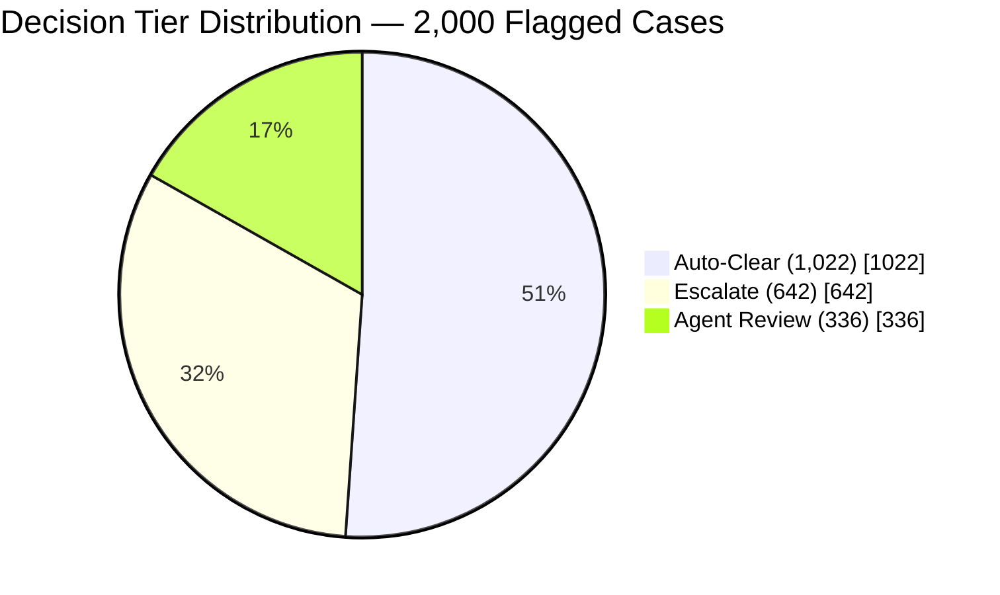
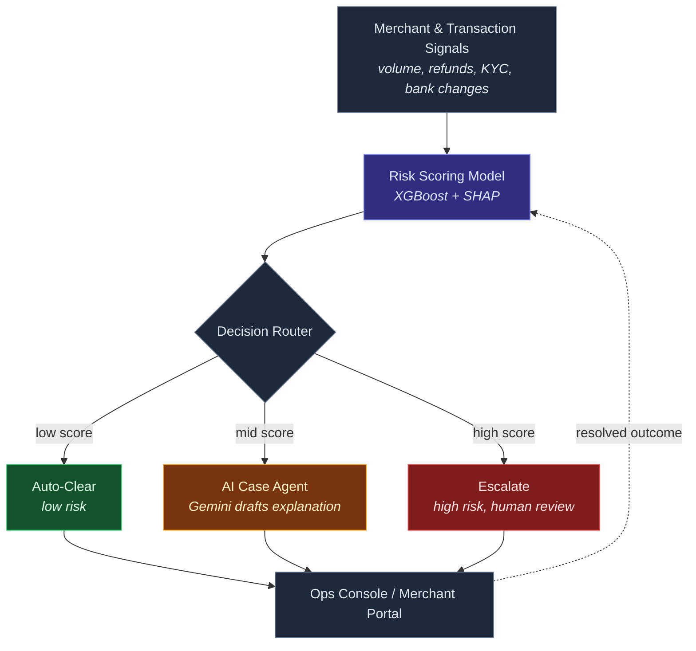
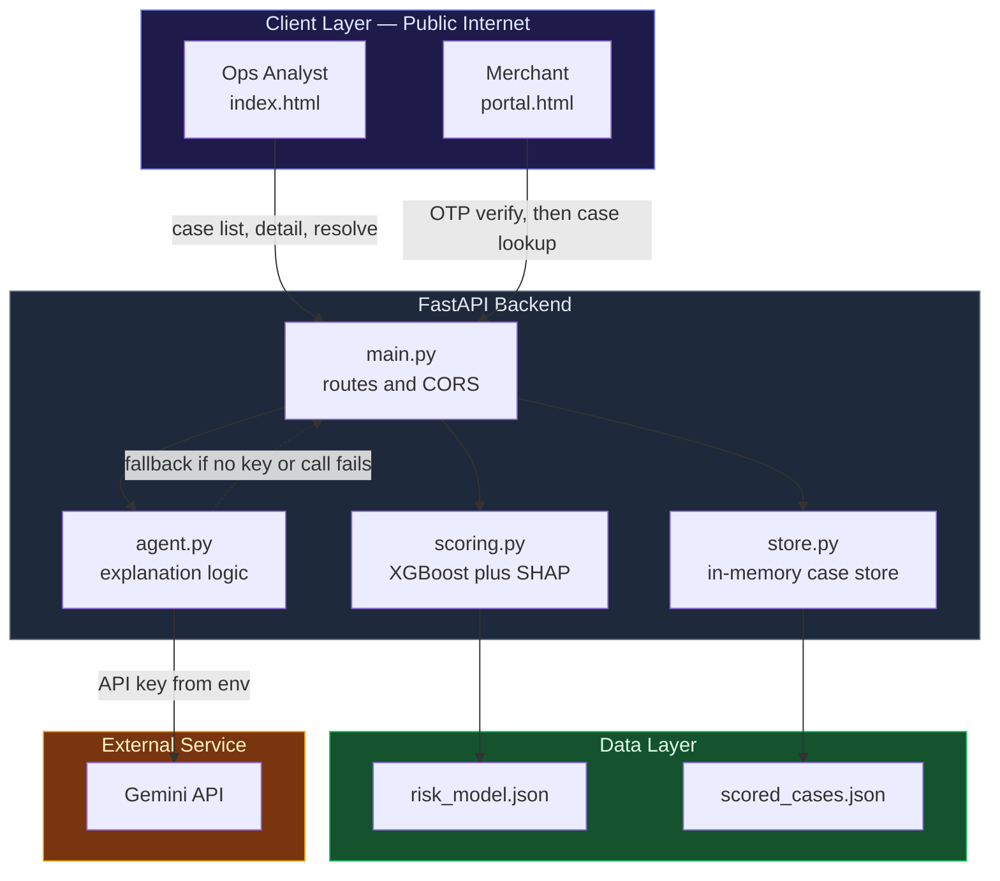
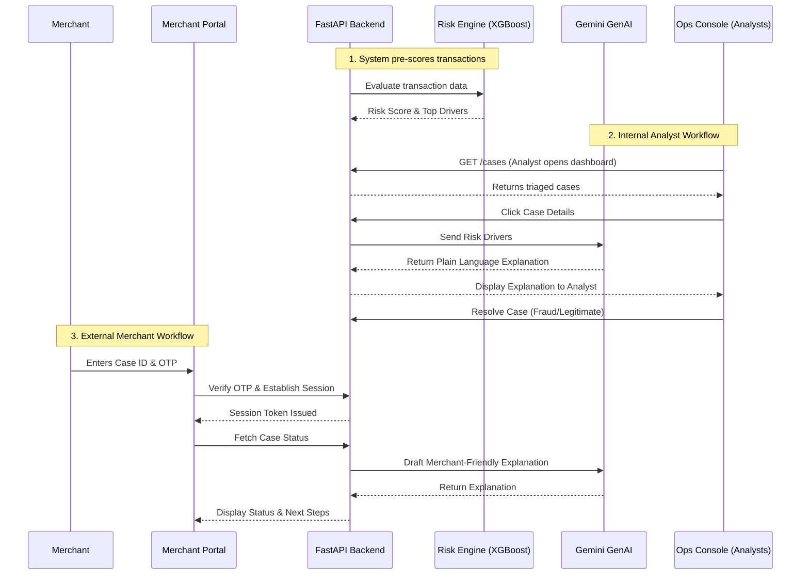

# Razorpay Trust Copilot

### An explainable risk engine that stops freezing innocent merchants

*Built for the Razorpay AI Buildathon — Track 5 : Open Track*

[](https://www.python.org/)
[](https://fastapi.tiangolo.com/)
[](https://xgboost.readthedocs.io/)
[](https://shap.readthedocs.io/)
[](https://ai.google.dev/)
[](https://github.com/2KRISHNAYADAV/Razorpay-trust-copilot)

</div>

---

## Table of contents

- [Why Trust Copilot](#why-trust-copilot)
- [The problem](#the-problem)
- [Our solution](#our-solution)
- [Measured impact](#measured-impact)
- [Key features](#key-features)
- [Architecture](#architecture)
- [Tech stack](#tech-stack)
- [Security](#security)
- [Getting started](#getting-started)
- [API reference](#api-reference)
- [Project structure](#project-structure)
- [Application screenshots](#application-screenshots)
- [Notebook — merchant_risk_copilot](#notebook--merchant_risk_copilot)
- [What broke, and how we fixed it](#what-broke-and-how-we-fixed-it)
- [Roadmap](#roadmap)

---

## Why Trust Copilot

- **Explainable, not just accurate.** Every decision comes with a specific, human-readable reason, not a bare score.
- **Balances both sides of the cost.** Measured against false-positive freezes *and* missed fraud, not just one.
- **Built for both sides of the relationship.** An ops console for the risk team, a self-serve portal for the merchant, protected by real authentication — not a Case ID left open to anyone who has it.
- **A real, running API.** Score a case live via `POST /score`, not a static demo.

---

## The problem

Payment gateways like Razorpay process millions of transactions daily. To prevent fraud, risk engines automatically flag thousands of merchants for suspicious activity such as sudden volume spikes, high chargeback rates, or unusual account age.

However, the traditional review process is deeply flawed:

1. **Analyst Fatigue & Context Switching:** Risk analysts have to dig through complex, raw data tables to figure out *why* a merchant was flagged, slowing down the resolution process.
2. **The "Black Box" of ML:** Risk scores are just numbers. A score of "85% Risk" doesn't tell an analyst what exactly went wrong.
3. **Merchant Anxiety & Support Overload:** Merchants are left completely in the dark when their payouts are paused. They don't know why it happened or what to do next, leading to thousands of frustrated support tickets.

---

## Our solution

Pipeline: **Risk scoring → 3-tier decision routing → SHAP explanations → GenAI explanation → Ops Console → Merchant Portal**

**Razorpay Trust Copilot** completely revolutionizes the risk review workflow by introducing AI-driven explainability and a dual-sided platform (Internal Ops + Public Merchant Portal).

1. **Automated Triage:** Automatically scores and categorizes cases into `Auto Clear`, `Agent Review`, and `Escalate` tiers.
2. **AI Explainability (GenAI):** Translates raw numeric risk drivers into plain-language summaries. Instead of looking at raw metrics, an analyst reads: *"This account was flagged because of a sudden 300% change in transaction volume combined with a high chargeback rate."*
3. **Secure Self-Serve Merchant Portal:** A no-login public portal where merchants can securely check their case status, read an AI-generated explanation of their hold, and understand next steps without raising a support ticket.

   


---

## Measured impact

On a 2,000-case held-out test set:

| Metric | Naive policy* | Trust Copilot |
| --- | --- | --- |
| Legitimate merchants wrongly frozen | 71.3% | 2.6% |
| Real fraud still caught | — | 95.1% |
| Model ROC-AUC | — | 0.853 |

*Naive policy = freeze anyone with an unusual volume spike or a recent bank account change — the pattern implied by the complaints above.*



| Tier | Cases | Actually fraud |
| --- | --- | --- |
| Auto-Clear | 1,022 | 3.8% |
| Agent Review | 336 | 43.8% |
| Escalate | 642 | 95.2% |

The **Agent Review** tier is the whole point of this project: a genuinely 44/56 mixed bucket that a blunt system currently just freezes by default. That's exactly where explanation — not a rule — earns its keep.

---

## Key features

### Ops Console (`/`)

- **Instant Triage & Filtering:** Rapidly filter thousands of cases by decision tier, Case ID, or merchant name.
- **Real-Time Search:** Blazing fast search by `Case ID` or `Merchant Name`.
- **Slide-in Detail Panel:** Deep-dive into a merchant's profile to view their risk score, AI-generated explanation, and top contributing factors.
- **One-Click Resolution:** Analysts can mark cases as `Fraud` or `Legitimate` with instant UI feedback and backend state updates.
- **Export to CSV:** One-click export of filtered lists for compliance reporting.

### Risk Analytics (`/eda.html`)

- **Real-time macro view** of the risk landscape: risk-score distribution, decision-tier breakdown, and average risk by merchant category (MCC).
- **Executive-summary stat cards** for top-level metrics at a glance.

### Merchant Portal (`/portal.html`)

- **Secure Case Verification:** Protects sensitive financial data. Merchants enter their `CASE ID` and must complete a 6-digit OTP verification challenge (Demo OTP: `123456`).
- **AI Trust Assistant:** An automated assistant that explains the hold to the merchant in non-technical terms.
- **Brute-Force Protection:** Rate limiting and session lockouts to prevent malicious scraping of case data.
- **Real status and explanation** instead of silence.
- **Supporting-document prompt** if a case is `agent_review`.
- **Clear, product-voice error states** for invalid IDs or failed verification — no dead ends.

---

## Architecture

### System overview



**A deliberate design choice, not a default:** the fraud/no-fraud *decision* runs on a classical model (XGBoost + SHAP), never a language model. A decision that has to be audited and defended needs to be deterministic and traceable, not something that could quietly hallucinate. Generative AI is used exactly once in the pipeline, for the part it's actually good at: turning a structured decision into a clear, specific sentence a merchant can understand.

> **Design note:** a preferred case-review field order would be Risk Score → Risk Reason → Decision Tier → Case Status → Owner → SLA → Review.

### Layered architecture



### System workflow



---

## Tech stack

| Layer | Choice | Why |
| --- | --- | --- |
| Risk model | XGBoost | Handles mixed tabular features well, trains fast, pairs natively with SHAP |
| Explainability | SHAP (TreeExplainer) | Exact, per-case, human-mappable feature attributions, not a black box |
| Explanation agent | `google-genai` (Gemini) | Language judgment on ambiguous, free-text explanation, not the risk decision itself |
| Backend | FastAPI + pandas | Async, typed with Pydantic, fast to iterate, serves both the API and static frontend |
| Persistence | In-memory case store | Fast for a hackathon build; case retrieval, tier filtering, and resolution state all live in `store.py` |
| Frontend | Vanilla HTML/CSS/JS | Zero build step — no Webpack, no React, no `npm install` |
| Design system | Custom light theme, `Inter` + `JetBrains Mono` | Readable data tables, consistent visual language across Ops Console, Analytics, and Portal |
| Synthetic data | Faker + a noisy logistic ground-truth model | See [What broke](#what-broke-and-how-we-fixed-it) below — this wasn't the first version |

**Why this stack:**

1. **FastAPI over Django/Flask:** High throughput and async operations (for querying the Gemini API) without massive overhead.
2. **Vanilla JS/CSS over React/Tailwind:** Keeps the project lightweight, easily deployable, and fast. Custom CSS gave 100% control over micro-animations and the Razorpay aesthetic without large frontend bundles.
3. **Google Gemini:** Exceptional reasoning capabilities for translating rigid financial data into empathetic, understandable text for both analysts and merchants.
4. **OTP Security Flow:** URL-parameter-based lookup (e.g., `?case_id=123`) was explicitly avoided because Case IDs are easily enumerable. The session-based OTP flow prioritizes enterprise-grade security.

---

## Security

A Case ID is treated as an identifier, not a credential — knowing it is not enough on its own to see a merchant's private case data.

- **Two-factor case verification.** After entering a Case ID, the merchant must clear a six-digit one-time-code challenge before any data is returned. This closes off Case ID enumeration as an attack path.
- **Server-managed sessions.** A successful verification issues a cryptographically secure, HttpOnly session cookie valid for 30 minutes. Every subsequent call to case data or the Trust Assistant is gated behind that session, not the Case ID alone.
- **Rate limiting and lockouts.** Five failed verification attempts lock the Case ID out for 15 minutes, blunting brute-force attempts against the one-time code.


---

## Getting started

### Prerequisites

- Python 3.10+
- *(Optional)* a Google Gemini API key, for AI-generated explanations. The app runs and falls back to a deterministic explanation without one.

### Installation and running

```bash
# 1. Clone
git clone https://github.com/2KRISHNAYADAV/Razorpay-Trust-Copilot.git
cd Razorpay-Trust-Copilot


# 2. Activate the virtual environment
#    Windows PowerShell:
.\venv\Scripts\activate
#    The venv is also available at backend/.venv — activate with:
#    .\backend\.venv\Scripts\activate

# 3. Install dependencies
pip install -r backend/requirements.txt

# 4. (Optional) configure your Gemini key
cp backend/.env.example backend/.env
# then edit backend/.env and set GEMINI_API_KEY, or export directly:
# export GEMINI_API_KEY="your-api-key-here"   (bash / macOS / Linux)
# $env:GEMINI_API_KEY="your-api-key-here"      (Windows PowerShell)

# 5. Start the server (run from the repo root, not inside backend/)
python backend/main.py
# Alternatively, using uvicorn directly:
# python -m uvicorn backend.main:app --host 127.0.0.1 --port 8000 --reload
```

Once running:

| URL | What it serves |
| --- | --- |
| [http://127.0.0.1:8000](http://127.0.0.1:8000) | Ops Console (Internal) |
| [http://127.0.0.1:8000/eda.html](http://127.0.0.1:8000/eda.html) | Risk Analytics |
| [http://127.0.0.1:8000/portal.html](http://127.0.0.1:8000/portal.html) | Merchant Portal (demo OTP: `123456`) |
| [http://127.0.0.1:8000/docs](http://127.0.0.1:8000/docs) | Interactive API docs (Swagger UI) |

**Retraining or regenerating the data:** open `notebook/merchant_risk_copilot.ipynb` in Jupyter or Colab and run all cells. It regenerates `flagged_cases.csv`, `scored_cases.{csv,json}`, and `risk_model.json` from scratch.

---

## API reference

### Decision tier thresholds

| `risk_score` | `decision_tier` |
| --- | --- |
| < 0.20 | `auto_clear` |
| 0.20 – 0.69 | `agent_review` |
| >= 0.70 | `escalate` |

### Endpoints

#### `GET /health`

Liveness check — confirms the server is up.

```bash
curl http://127.0.0.1:8000/health
```

**Response**
```json
{"status": "ok"}
```

---

#### `GET /cases`

Returns all 2,000 pre-scored cases sorted by `risk_score` descending.
Filter by tier with `?tier=` and change the sort key with `?sort=`.

```bash
# all cases (default sort: risk_score desc)
curl "http://127.0.0.1:8000/cases"

# only agent-review cases
curl "http://127.0.0.1:8000/cases?tier=agent_review"

# escalate cases sorted by risk_score (explicit)
curl "http://127.0.0.1:8000/cases?tier=escalate&sort=risk_score"


```

Valid `tier` values: `auto_clear` · `agent_review` · `escalate`

**Response** — array of `CaseRecord` objects (truncated):
```json
[
  {
    "case_id": "CASE00781",
    "merchant_name": "Carter-Neal",
    "mcc_category": "saas_subscription",
    "risk_score": 0.6961,
    "decision_tier": "agent_review",
    "ground_truth_label": "fraud",
    "top_reasons": [ "..." ],
    "plain_language_explanation": null
  }
]
```

> `plain_language_explanation` is `null` in list responses for performance. It is populated on-demand by `GET /cases/{case_id}`.

---

#### `GET /cases/{case_id}`

Returns one full case record, including a `plain_language_explanation`
generated by `agent.draft_explanation()` (Gemini if key is set, deterministic otherwise).

```bash
curl http://127.0.0.1:8000/cases/CASE00015
```

**Response**
```json
{
  "case_id": "CASE00015",
  "merchant_name": "Galloway-Wyatt",
  "mcc_category": "fashion_apparel",
  "risk_score": 0.2085,
  "decision_tier": "agent_review",
  "ground_truth_label": "legitimate",
  "top_reasons": [
    {
      "feature": "volume_spike_ratio",
      "friendly_label": "sudden change in transaction volume",
      "value": 4.9,
      "impact": 1.3888,
      "direction": "raises risk"
    },
    {
      "feature": "chargeback_rate_90d",
      "friendly_label": "chargeback rate",
      "value": 0.0058,
      "impact": -0.6071,
      "direction": "lowers risk"
    }
  ],
  "plain_language_explanation": "This account was flagged for review mainly because of sudden change in transaction volume. However, chargeback rate and average transaction size appear within normal range and partially offset the concern."
}
```

---

#### `POST /score`

Live-scores a merchant with the loaded XGBoost model + SHAP explainer.
Body: the 16 model features (+ `mcc_category` for metadata).

```bash
curl -X POST http://127.0.0.1:8000/score \
  -H "Content-Type: application/json" \
  -d '{
    "mcc_category": "education",
    "merchant_tenure_days": 708,
    "avg_daily_txn_30d": 5.0,
    "volume_spike_ratio": 2.89,
    "refund_rate_30d": 0.043,
    "chargeback_rate_90d": 0.033,
    "kyc_completeness_score": 0.9,
    "bank_account_changed_flag": 1,
    "days_since_bank_change": 0,
    "customer_complaint_count_30d": 4,
    "device_ip_diversity_score": 0.67,
    "night_txn_ratio": 0.32,
    "is_festive_period": 0,
    "prior_flags_count": 0,
    "prior_flags_confirmed_fraud": 0,
    "avg_ticket_size": 456.0,
    "ticket_size_change_ratio": 1.04
  }'
```

**Response**
```json
{
  "case_id": "LIVE",
  "merchant_name": "Live Score Request",
  "mcc_category": "education",
  "risk_score": 0.9303,
  "decision_tier": "escalate",
  "ground_truth_label": "legitimate",
  "top_reasons": [
    {
      "feature": "customer_complaint_count_30d",
      "friendly_label": "customer complaint volume",
      "value": 4.0,
      "impact": 1.1739,
      "direction": "raises risk"
    }
  ],
  "plain_language_explanation": "This account was flagged for immediate escalation primarily because of customer complaint volume and chargeback rate."
}
```

---

#### `POST /cases/{case_id}/resolve`

Records an analyst's verdict for a case.
Updates `ground_truth_label` in memory and returns the updated record.

```bash
curl -X POST http://127.0.0.1:8000/cases/CASE00015/resolve \
  -H "Content-Type: application/json" \
  -d '{"resolved_as": "fraud", "notes": "Confirmed via manual document check"}'
```

**Response** — the updated `CaseRecord` with `ground_truth_label` changed and `plain_language_explanation` populated.

> **Note:** Updates are in-memory only and do not survive a server restart.
> Run `export_resolved.py` to persist resolved cases to `data/retrain_queue.csv`.

---

#### `GET /cases/resolved`

Returns all cases resolved by analysts since server startup.

```bash
curl http://127.0.0.1:8000/cases/resolved
```

**Response** — array of resolved `CaseRecord` objects (same shape as `GET /cases`).

---

### Retraining path

After resolving cases via the API, export the analyst-labelled rows:

```bash
python -m backend.export_resolved
# writes to data/retrain_queue.csv
```

The output file uses the same column layout as `data/flagged_cases.csv`
so it can be concatenated directly for retraining:

```bash
# merge with original training data (Windows)
type data\flagged_cases.csv data\retrain_queue.csv > data\combined.csv
```

---

## Project structure

```
razorpay-trust-copilot/
├── notebook/
│   └── merchant_risk_copilot.ipynb   # data generation, training, evaluation, SHAP
├── data/
│   ├── flagged_cases.csv             # raw synthetic dataset (2,000 rows, 16 features + label)
│   ├── scored_cases.csv
│   └── scored_cases.json
├── model/
│   └── risk_model.json               # trained XGBoost model artifact
├── backend/                          # FastAPI service — scoring, explanation, case store
│   ├── main.py                       # routes, CORS, portal auth
│   ├── scoring.py                    # risk scoring logic (XGBoost + SHAP)
│   ├── agent.py                      # Gemini explanation integration
│   ├── store.py                      # in-memory case store
│   ├── schemas.py                    # Pydantic v2 models (CaseRecord, ScoreRequest, ResolveRequest)
│   ├── export_resolved.py            # CLI tool: dumps resolved cases to data/retrain_queue.csv
│   ├── .env.example
│   └── requirements.txt
├── frontend/                         # ops console, analytics, and merchant portal
│   ├── index.html                    # Ops Console
│   ├── eda.html                      # Risk Analytics dashboard
│   ├── portal.html                   # Merchant Portal
│   ├── styles.css
│   └── app.js
├── screenshots/
└── docs/
    └── BUILD_LOG.md                  # the actual prompts used to build this with an AI coding agent
```


## Application Screenshots

| **Ops Console** | **Analytics Dashboard** |
|:---:|:---:|
|  |  |
| **Analytics — Detailed View** | **Merchant Portal** |
|  |  |
| **Merchant Portal — OTP Challenge** | **Merchant Portal — Case Result** |
|  |  |

---

## Notebook  `merchant_risk_copilot`

<table>
  <tr>
    <td align="center">
      
    </td>
    <td align="center">
      
    </td>
  </tr>
  <tr>
    <td align="center">
      
    </td>
    <td align="center">
      
    </td>
  </tr>
</table>

 

  </tr>
</table>


---

## What broke, and how we fixed it

The first version of the synthetic dataset hit 100% test accuracy. That's not a win, it's a red flag. The fraud label had been hardcoded directly from the scenario archetype, which made the classes trivially separable and the classifier meaningless.

The fix: the ground-truth label is sampled from a noisy logistic function of the actual features — device/IP diversity, transaction timing, chargeback rate, recency of bank changes — with a real Gaussian noise term, so an archetype only *tends toward* its label instead of guaranteeing it. That brought test accuracy down to a believable 79% (ROC-AUC 0.853): worse-looking on paper, but the only version that means anything.

---

## Roadmap

The roadmap below outlines the planned improvements across **Security, Merchant Experience, and Internal Operations**.
Update the **Status** field as each item progresses: `Planned` → `In Progress` → `Done`.

### 🔐 Security

| ID  | Improvement                                                                                         | Purpose                                                         | Priority    | Effort | Status  |
| --- | --------------------------------------------------------------------------------------------------- | --------------------------------------------------------------- | ----------- | ------ | ------- |
| S-1 | Replace the demo OTP (`123456`) with a real SMS/email provider such as Twilio, AWS SNS, or SendGrid | Enable secure OTP delivery before handling real merchant data   | 🔴 Critical | Medium | Planned |
| S-2 | Replace wildcard CORS (`["*"]`) with an explicit frontend origin allowlist                          | Prevent unauthorised websites from accessing the API            | 🔴 Critical | Low    | Planned |
| S-3 | Add JWT or secure session-based authentication to the Ops Console (`/`, `/eda.html`)                | Prevent unauthorised access to internal risk operations         | 🔴 Critical | Medium | Planned |
| S-4 | Move session storage from process memory to Redis or a database                                     | Preserve sessions across restarts and multiple server instances | 🟠 High     | Medium | Planned |
| S-5 | Enable HTTPS/TLS through nginx, Caddy, or a cloud load balancer                                     | Protect OTP codes and case data while in transit                | 🔴 Critical | Low    | Planned |
| S-6 | Rotate and scope the Gemini API key using least-privilege access                                    | Reduce the impact of leaked or exposed credentials              | 🟠 High     | Low    | Planned |
| S-7 | Add security headers including CSP and X-Frame-Options                                              | Strengthen protection against XSS and clickjacking              | 🟡 Medium   | Low    | Planned |
| S-8 | Pin dependencies and add Dependabot/Renovate checks                                                 | Detect vulnerable or outdated packages early                    | 🟡 Medium   | Low    | Planned |

### 🌐 Public — Merchant Portal (`/portal.html`)

| ID  | Improvement                                                    | Purpose                                                            | Priority    | Effort | Status  |
| --- | -------------------------------------------------------------- | ------------------------------------------------------------------ | ----------- | ------ | ------- |
| P-1 | Connect OTP verification to a real SMS/email provider          | Allow merchants to complete secure self-service verification       | 🔴 Critical | Medium | Planned |
| P-2 | Add supporting-document uploads for `agent_review` cases       | Give merchants a direct way to submit additional evidence          | 🟠 High     | High   | Planned |
| P-3 | Add email/SMS notifications for case-status changes            | Keep merchants informed and reduce unnecessary support requests    | 🟠 High     | Medium | Planned |
| P-4 | Add internationalisation (i18n) with Hindi and English support | Improve accessibility for a wider Indian merchant base             | 🟡 Medium   | High   | Planned |
| P-5 | Add an appeal/dispute form for flagged cases                   | Give merchants a structured way to explain or challenge a decision | 🟡 Medium   | Medium | Planned |
| P-6 | Show a live SLA countdown for active reviews                   | Set clear expectations around review timelines                     | 🟢 Low      | Low    | Planned |

### 🛠️ Internal — Ops Console, Analytics & Infrastructure

| ID   | Improvement                                                                        | Purpose                                                                  | Priority    | Effort | Status  |
| ---- | ---------------------------------------------------------------------------------- | ------------------------------------------------------------------------ | ----------- | ------ | ------- |
| I-1  | Replace the in-memory case store with PostgreSQL                                   | Persist cases, verdicts, and sessions across restarts                    | 🔴 Critical | High   | Planned |
| I-2  | Feed resolved cases into a scheduled model-retraining pipeline                     | Allow analyst corrections to improve future model performance            | 🟠 High     | High   | Planned |
| I-3  | Add role-based access control for analysts, supervisors, and read-only users       | Apply appropriate permissions to different operations roles              | 🟠 High     | Medium | Planned |
| I-4  | Add case assignment and analyst ownership                                          | Prevent multiple analysts from working on the same case at once          | 🟠 High     | Medium | Planned |
| I-5  | Add SLA timers and escalation alerts for ageing `agent_review` cases               | Prevent cases from remaining unattended                                  | 🟠 High     | Medium | Planned |
| I-6  | Add an in-console **Export for Retraining** action                                 | Remove the need to run `export_resolved.py` manually                     | 🟡 Medium   | Low    | Planned |
| I-7  | Introduce structured JSON logging with `case_id` and `analyst_id`                  | Improve debugging, tracing, and operational monitoring                   | 🟡 Medium   | Low    | Planned |
| I-8  | Add a database-backed audit trail for every resolution action                      | Track timestamps, analysts, and before/after verdicts for accountability | 🟠 High     | Medium | Planned |
| I-9  | Add unit tests for `scoring.py`, `agent.py`, and `store.py` with GitHub Actions CI | Create an automated quality and regression-safety layer                  | 🟡 Medium   | Medium | Planned |
| I-10 | Containerise the service with Docker and add Compose/Kubernetes deployment files   | Make local setup and deployment more consistent across environments      | 🟢 Low      | Medium | Planned |

---

<div align="center">

**Built for the Razorpay AI Buildathon** · Track 5 — Open Track

</div>

